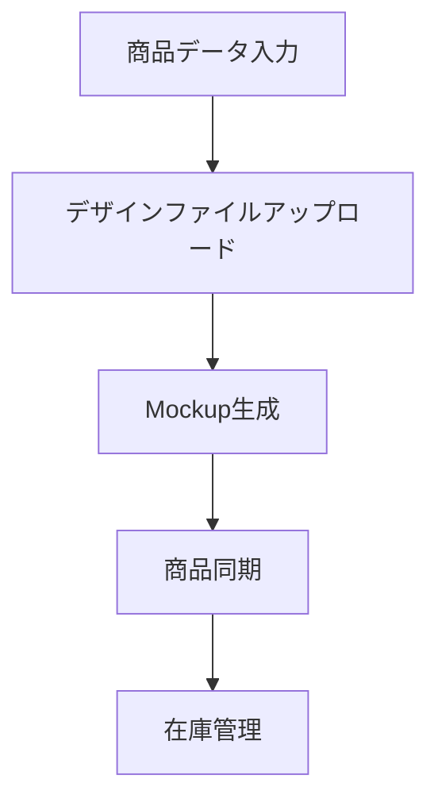
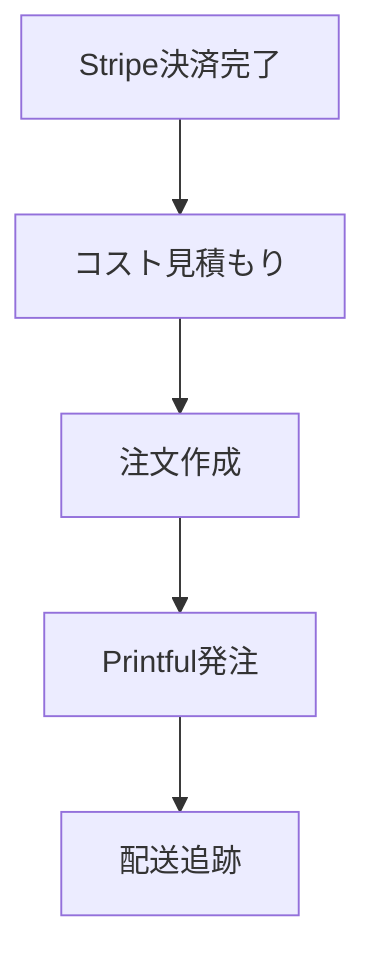

# Printful API v2 Integration Documentation

## 概要

このドキュメントでは、[Printful API v2](https://developers.printful.com/docs/#tag/Products-API)を使用した強化された統合システムについて説明します。

## 主な改善点

### 1. **API v2対応**
- 最新のPrintful API v2エンドポイントを使用
- より詳細なエラーハンドリング
- 改善されたレスポンス形式

### 2. **Mockup Generator API統合**
- リアルタイムモックアップ生成
- 複数の配置オプション
- 高品質なプレビュー画像

### 3. **コスト見積もり機能**
- 注文前のコスト計算
- 詳細な価格内訳
- 小売価格と卸価格の比較

### 4. **強化されたエラーハンドリング**
- 詳細なエラーメッセージ
- トラブルシューティングガイド
- 自動リトライ機能

## 新しいAPIエンドポイント

### 1. Mockup Generator API v2
```
POST /api/printful-mockup-v2
```

**機能:**
- リアルタイムモックアップ生成
- 複数の配置オプション
- 高品質なプレビュー画像

**リクエスト例:**
```json
{
  "productId": 162,
  "variantIds": [6584, 6585],
  "designUrl": "https://example.com/design.png",
  "placement": "front"
}
```

**レスポンス例:**
```json
{
  "success": true,
  "message": "Mockup generated successfully",
  "taskKey": "task_12345",
  "mockups": [
    {
      "placement": "front",
      "image_url": "https://printful.com/mockup.jpg",
      "variant_ids": [6584, 6585]
    }
  ]
}
```

### 2. Enhanced Order API v2
```
POST /api/printful-order-v2
```

**機能:**
- コスト見積もり
- 詳細な注文作成
- 強化されたバリデーション

**リクエスト例:**
```json
{
  "externalId": "order_12345",
  "items": [
    {
      "variant_id": 6584,
      "quantity": 1,
      "name": "Custom T-Shirt",
      "files": [
        {
          "id": 12345,
          "type": "default",
          "url": "https://example.com/design.png"
        }
      ]
    }
  ],
  "shippingAddress": {
    "name": "John Doe",
    "address1": "123 Main St",
    "city": "New York",
    "country_code": "US",
    "zip": "10001"
  },
  "customerEmail": "john@example.com",
  "estimateCosts": true
}
```

## 統合フロー

### 1. 商品作成フロー


### 2. 注文処理フロー


## 実装例

### 1. 基本的な注文作成
```typescript
import { createEnhancedPrintfulOrder } from '@/lib/printful-v2-integration'

const order = await createEnhancedPrintfulOrder(
  'order_12345',
  items,
  shippingAddress,
  'customer@example.com',
  {
    estimateCosts: true,
    useMockups: true
  }
)
```

### 2. モックアップ生成
```typescript
import { generateProductMockups } from '@/lib/printful-v2-integration'

const mockup = await generateProductMockups(
  '162',
  'https://example.com/design.png',
  [6584, 6585],
  'front'
)
```

## エラーハンドリング

### 1. API v2エラー形式
```json
{
  "code": 400,
  "result": "Bad Request",
  "error": {
    "reason": "ValidationError",
    "message": "Invalid variant ID provided"
  }
}
```

### 2. 強化されたエラーレスポンス
```json
{
  "success": false,
  "error": "Invalid variant ID provided",
  "code": 400,
  "details": "Specific error information",
  "troubleshooting": [
    "1. Verify all variant IDs are valid",
    "2. Check recipient address format",
    "3. Ensure file URLs are accessible"
  ]
}
```

## 設定

### 環境変数
```env
# Printful API設定
PRINTFUL_API_KEY=your_printful_api_key_v2
```

### データベース更新
```sql
-- 注文テーブルにAPI v2関連フィールドを追加
ALTER TABLE orders 
ADD COLUMN printful_v2_order_id VARCHAR(50),
ADD COLUMN printful_v2_external_id VARCHAR(100),
ADD COLUMN mockup_task_key VARCHAR(100);
```

## テスト

### 1. Mockup Generator API
```bash
curl -X POST http://localhost:3000/api/printful-mockup-v2 \
  -H "Content-Type: application/json" \
  -d '{
    "productId": 162,
    "variantIds": [6584],
    "designUrl": "https://example.com/design.png"
  }'
```

### 2. Enhanced Order API
```bash
curl -X POST http://localhost:3000/api/printful-order-v2 \
  -H "Content-Type: application/json" \
  -d '{
    "externalId": "test_order_123",
    "items": [...],
    "shippingAddress": {...},
    "estimateCosts": true
  }'
```

## パフォーマンス最適化

### 1. キャッシュ戦略
- Mockup画像のキャッシュ
- 商品情報のキャッシュ
- APIレスポンスのキャッシュ

### 2. 非同期処理
- バックグラウンドでのモックアップ生成
- キューシステムの実装
- Webhookによる状態更新

## セキュリティ

### 1. API認証
- Bearer token認証
- レート制限の実装
- リクエスト検証

### 2. データ保護
- 機密情報の暗号化
- ログのサニタイゼーション
- アクセス制御

## 監視とログ

### 1. メトリクス
- API呼び出し回数
- レスポンス時間
- エラー率

### 2. アラート
- API制限の監視
- エラー率の監視
- パフォーマンスの監視

## トラブルシューティング

### 1. 一般的な問題
- API制限に達した場合
- 無効なvariant ID
- ファイルアップロードエラー

### 2. デバッグ手順
1. ログの確認
2. APIレスポンスの検証
3. データベース状態の確認
4. Printfulダッシュボードの確認

## 今後の改善

### 1. 計画中の機能
- リアルタイム在庫同期
- 自動価格調整
- 高度なレポート機能

### 2. 技術的改善
- GraphQL APIの導入
- マイクロサービス化
- クラウドネイティブ化

## 参考資料

- [Printful API v2 Documentation](https://developers.printful.com/docs/#tag/Products-API)
- [Mockup Generator API](https://developers.printful.com/docs/#tag/Mockup-Generator-API)
- [Orders API](https://developers.printful.com/docs/#tag/Orders-API)
- [Products API](https://developers.printful.com/docs/#tag/Products-API)
